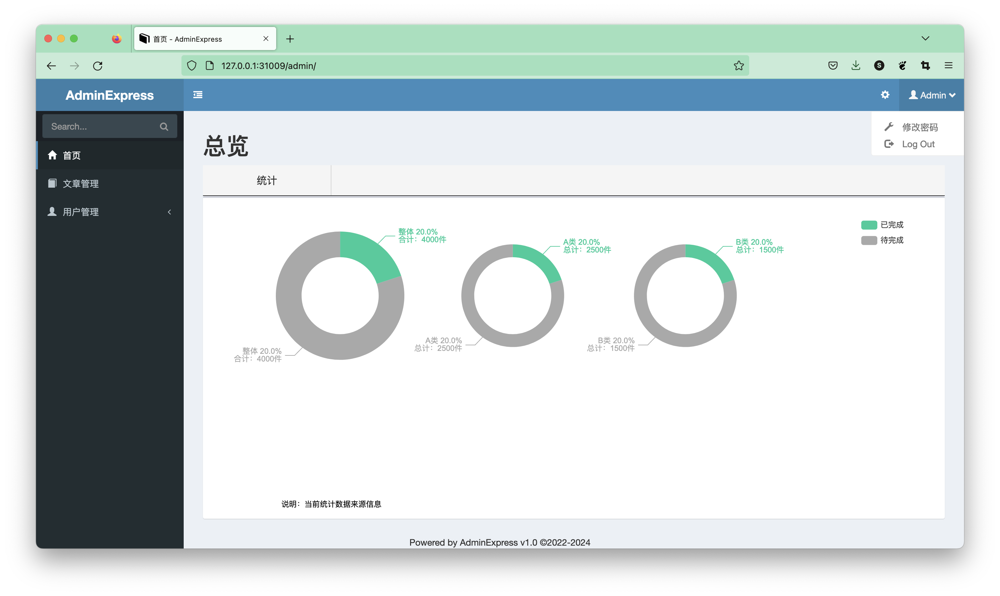

Admin Express 项目介绍
==============
一个适用于快速开发的通用后台管理系统。

集成的主要框架：
 - Flask-Admin v1.6.0，快速开发Web框架, 基于 Flask + Bootstrap
 - AdminLTE v2.4.18，Web前端框架，响应式的管理系统模版，基于 jQuery + Bootstrap3
 - Flask 2.2.2，Python 世界中最流行的轻型 Web 框架

已集成的主要组件：
 - [PyECharts](https://github.com/pyecharts/pyecharts)，通过 python 操作 ECharts 的工具组件，更丰富便捷的图表能力！
 - Flask-SQLAlchemy，适配 flask的 ORM 框架，用于操作数据库。
 - Flask-Migrate，数据模型迁移管理工具，提供快速的升级降级命令行操作能力。
 - PyYAML，yaml格式的配置文件读写。

## 系统界面


## 如何运行？

### 1. 初始化项目
打开 shell，在当前项目主目录下，激活 Python虚拟环境（一般通过 virtualenv 或 conda 创建）。然后，配置并启动 flask 应用：

```shell
export FLASK_APP=manage.py
```
如果在 Windows系统 cmd 命令行执行，可通过 set命令：
```shell
set FLASK_APP=manage.py
```

### 2. 初始化数据库
```shell
flask db init
flask db migrate
flask db upgrade

# 自定义命令，自动创建管理员账户
flask account-init
```

### 3. 启动项目
直接在 命令行窗口执行如下命令，或通过 Pycharm 来运行项目（推荐方式）。
```shell
flask run
```
默认管理员账户为：```admin/Abcd@1234```，登陆系统并修改密码即可。


## 参与贡献

1.  Fork 本仓库
2.  新建 Feat_xxx 分支
3.  提交代码
4.  新建 Pull Request

